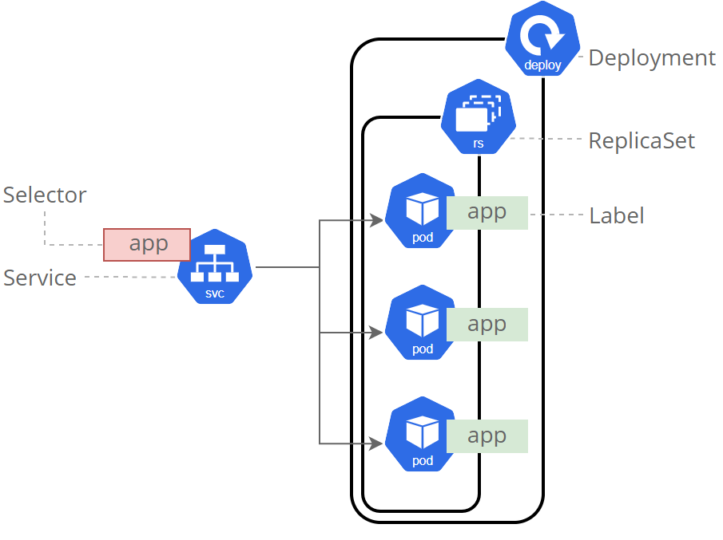
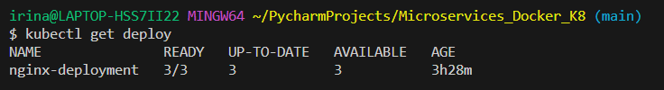
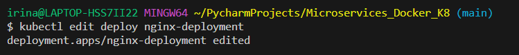
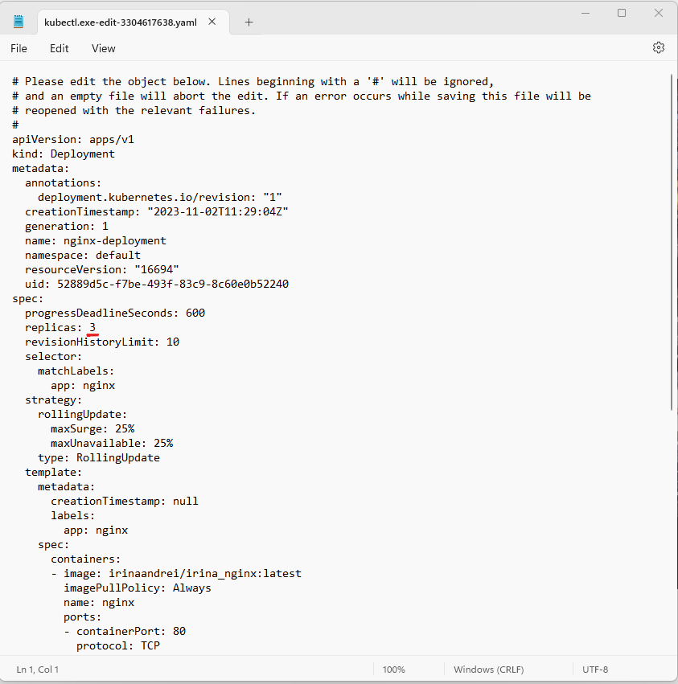
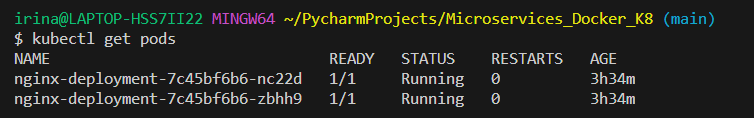
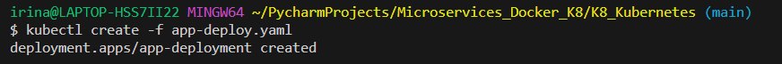
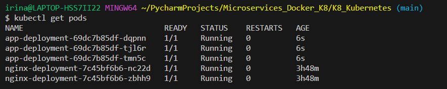
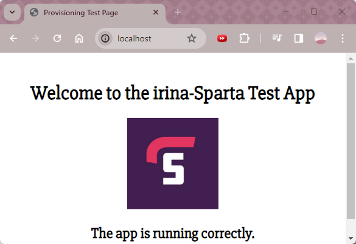

# Kubernetes (K8)

### Why K8?

**Kubernetes** (sometimes shortened to *K8s* with the 8 standing for the number of letters between the "K" and the "s") is *an open source system to deploy, scale and manage containerized applications anywhere*.

Kubernetes **automates operational tasks of container management** and includes built-in commands for deploying applications, rolling out changes to your applications, scaling your applications up and down to fit changing needs and monitoring your applications, making it easier to manage applications.

<br>

### What are the benefits of Kubernetes?
* **Automated operations**: Kubernetes has built-in commands to handle a lot of the heavy lifting that goes into application management, allowing you to automate day-to-day operations. You can make sure applications are always running the way you intended them to run.

* **Infrastructure abstraction**: When you install Kubernetes, it handles the compute, networking and storage on behalf of your workloads. This allows developers to focus on applications and not worry about the underlying environment.

* **Service health monitoring**: Kubernetes continuously runs health checks against your services, restarting containers that fail, or have stalled and only making available services to users when it has confirmed they are running.

* **Easier application upgrades and maintenance**: Kubernetes allows you to roll out new software versions, perform health checks and revert changes with minimal downtime.

* **Multi-cloud capability**: Kubernetes enables you to run your applications across multiple cloud providers without vendor lock-in or compatibility issues.

<br>


<br>

### Kubernetes vs. Docker
Often misunderstood as a choice between one or the other, **Kubernetes and Docker are different yet complementary technologies** *for running containerized applications.*

Docker lets you put everything you need to run your application into a box that can be stored and opened when and where it is required. Once you start boxing up your applications, you need a way to manage them; and that's what Kubernetes does.

Kubernetes is a Greek word meaning 'captain' in English. Like the captain is responsible for the safe journey of the ship in the seas, Kubernetes is responsible for carrying and delivering those boxes safely to locations where they can be used.

**Kubernetes can be used with or without Docker**: Docker is not an alternative to Kubernetes, so it's less of a “Kubernetes vs. Docker” question. It's about using Kubernetes with Docker to containerize your applications and run them at scale.

The difference between Docker and Kubernetes relates to the role each play in containerizing and running your applications:
* Docker is *an open industry standard* for packaging and distributing applications in containers
* Kubernetes *uses Docker* to deploy, manage and scale containerized applications

<br>

### K8 APIs

The Kubernetes API is **a resource-based (RESTful) programmatic interface** provided via HTTP. It supports *retrieving, creating, updating and deleting primary resources* via the standard HTTP verbs (POST, PUT, PATCH, DELETE, GET). A resource is an object that represents a piece of the cluster such as *a pod, a service or a node*. Each resource has a unique name and an associated type, group and version. 

The Kubernetes API is **the fundamental fabric of Kubernetes**. All operations and communications between components and external user commands are REST API calls that the API Server handles. Consequently, **everything in the Kubernetes platform is treated as an API object** and has *a corresponding entry in the API*. The Kubernetes API also provides mechanisms for controlling access, managing resources quotas and limits, enforcing policies and monitoring the cluster state.

<br>

### K8 Volumes:
* **EV - Ephemeral Volume** = volumes that do not store data persistently and are deleted when the pod is terminated. Ephemeral volumes are useful for temporary data such as caches, logs or secrets. 
* **PV - Persistent Volume** = volumes that store data persistently across restarts and are abstracted from the underlying storage provider by an API. 
* *PVC - Persistent Volume Claim* = a way for a Pod to request and use a **Persistent Volume** (PV) in Kubernetes. 


Documentation:
- [Kubernetes Volumes](https://kubernetes.io/docs/concepts/storage/volumes/)
- [Amazon - Persistent storage K8](https://aws.amazon.com/blogs/storage/persistent-storage-for-kubernetes/)

<br>

### When not to use K8?

* Kubernetes is complex and requires a lot of expertise to set up and maintain. You need to understand the concepts and components of Kubernetes (pods, services, deployments ingress etc). You also need to deal with security, networking, monitoring, logging and troubleshooting issues.

* Kubernetes is not necessary if you have a simple or monolithic application that does not need high availability, scalability or portability. Kubernetes is designed for distributed applications that have multiple services that need to communicate with each other and run on different nodes. If you have a single-page app or a small backend service that can run on a single server or a virtual machine, you might be better off using simpler tools. 


<br>

## Steps for installing Kubernetes:

1. Go to Docker Desktop Settings and in the General tab, make sure these boxes are ticked:


2. In the Kubernetes tab, select 'Enable Kubernetes' and 'Show system containers':


3. You will know it has installed when the orange box turns to green:


4. Check it works:

```shell
kubectl
```


```shell
kubectl get service
```


```shell
kubectl get svc
# a shorter way to 'get service' information
```


```shell
docker ps
```


```shell
docker images
```


<br>


## K8 Deployment:
* Make the container scalable, using 3 replicas 
* The K8 Deployment will use 3 Pods (K8 will create the Auto-scaling group and the Load Balancer on our behalf, which we will not be able to see)
* We will codify K8 Deployment to launch our micro-services
* **nodePort**: this is a port in the range of 30000-32767 that will be open in each node. If left empty, Kubernetes selects a free one in that range. protocol: TCP is the default one, but you can use others like SCTP or UDP.

**Requirements**:
* Docker image of node app available on Docker Hub
* required ports enabled in the system
* .yaml deployment files


<br>

## Our Kubernetes Cluster



We will create a **Deployment** in the *running Kubernetes Cluster* with **ReplicaSet** (a service that K8 will create in the background); the ReplicaSet will have **3 Pods** attached. They will be connected to each other using the **labels** we provide.

Steps:

1. Write the deployment `nginx-deploy.yaml` file:

```yaml
apiVersion: apps/v1 # Which API to use for deployment
kind: Deployment # Pod - service; what kind of service/object you want to create

# What you would like to call it - name the service/object
metadata:
  name: nginx-deployment # Naming the deployment
spec:
  selector:
    matchLabels:
      app: nginx # Look for this label to match with K8 service
    # Let's create a replica set of this with instances/pods
  replicas: 3 # 3 Pods
    # Template to use its label for K8 service to launch in the browser
  template:
    metadata:
      labels:
        app: nginx #This label connects to the service or any other K8 components
  # Let's define the container spec
    spec:
      containers:
      - name: nginx
        image: irinaandrei/irina_nginx:latest # Use the image that you built
        ports: 
        - containerPort: 80 # The port to connect inside the container

# You also need to create a Kubernetes nginx-service.yaml to create a K8 ServiceKube.
```

2. Tell K8 to create the Deployment using the `nginx-deploy.yaml` file:

```shell
kubectl create -f nginx-deploy.yaml
```


3. Once deployed, you will be able to see the list of the running pods (will show container IDs and Running status):

```shell
kubectl get pods
```


If one of the pods crash, it won't make a difference to the deployment, as the Load Balancer will stop the traffic, the Auto Scaling group will terminate the instance, spin up a new one and the Load balancer will redirect the traffic. 

4. If you want to test that and delete a pod: 

```shell
kubectl delete pod <pod_ID>
```


A new pod (container) was created within 5 seconds.

5. If you want to verify the ReplicaSet that K8 created with the Deployment:

```shell
kubectl get rs
```


```shell
kubectl get svc
```


6. If you go to http://localhost it will not work. You need to create a Service .yaml file (`nginx-service.yaml`) in the same location, that will explose (facilitate) the Deployment to the external world by using the same labels:

```yaml
apiVersion: v1
kind: Service
metadata:
  name: nginx-service
spec:
  selector:
    app: nginx  # This should match the labels in your Nginx deployment
  ports:
    - protocol: TCP
      port: 80  # Port to expose on the service
      targetPort: 80  # Port that the Nginx pods are listening on
  type: NodePort  # Change to LoadBalancer or ClusterIP if needed
```

7. Run the `nginx-service.yaml` file which will create the Service in the same Cluster:

```shell
kubectl create -f nginx-service.yaml
```


8. That Service has now exposed the Deployment with all the micro-services inside. If you now go to http://localhost:31230 (whatever the generated port is) it will show you your nginx Home Page:


9. If you need to delete the Service: 

```shell
kubectl delete -f nginx-service.yaml
```


<br>


### If you want to increase (or decrease) the Pods number:

```shell
kubectl get deploy
# get the name of the deployment
```


Edit the deployment to scale down (or up):

```shell
kubectl edit deploy nginx-deployment
```



This will open the editor, you can change from 3 to 2:


```shell
kubectl get pods
# There will be 2 pods now
```



<br>

### Deploying the App Image in the same Cluster:

1. Write the deployment `app-deploy.yaml` file:

```yaml
apiVersion: apps/v1 # Which API to use for deployment
kind: Deployment # Pod - service; what kind of service/object you want to create

# What you would like to call it - name the service/object
metadata:
  name: app-deployment # Naming the deployment
spec:
  selector:
    matchLabels:
      app: app # Look for this label to match with K8 service
    # Let's create a replica set of this with instances/pods
  replicas: 3 # 3 Pods
    # Template to use its label for K8 service to launch in the browser
  template:
    metadata:
      labels:
        app: app #This label connects to the service or any other K8 components
  # Let's define the container spec
    spec:
      containers:
      - name: app
        image: irinaandrei/node-app:latest # Use the image that you built
        ports: 
        - containerPort: 3000 # The port to connect inside the container

# Create a Kubernetes app-service.yaml to create a K8 ServiceKube.
```

2. Tell K8 to create the Deployment using the `app-deploy.yaml` file:

```shell
kubectl create -f app-deploy.yaml
```


3. Once deployed, you will be able to see the list of the running pods (will show container IDs and Running status):

```shell
kubectl get pods
```



4. You now need to create a Service .yaml file (`app-service.yaml`) in the same location, that will explose (facilitate) the Deployment to the external world by using the same labels:

```yaml
apiVersion: v1
kind: Service
metadata:
  name: app-service
spec:
  selector:
    app: app  # This should match the labels in your app deployment
  ports:
    - protocol: TCP
      port: 80  # Port to expose on the service
      targetPort: 3000  # Port that the app pods are listening on
  type: LoadBalancer  # Change to NodePort or ClusterIP if needed
```

5. Run the `app-service.yaml` file which will create the Service in the same Cluster:

```shell
kubectl create -f app-service.yaml
```

```shell
kubectl get deploy
# See all deployments
```


6. If you go to http://localhost you will be able to see the App:



<br>

Sources:

- [What is Kubernetes - cloud.google.com](https://cloud.google.com/learn/what-is-kubernetes)
- [Kubernetes Service - kubernetes.io](https://kubernetes.io/docs/concepts/services-networking/service/)
- [Kubernetes Volumes](https://kubernetes.io/docs/concepts/storage/volumes/)
- [Amazon - Persistent storage K8](https://aws.amazon.com/blogs/storage/persistent-storage-for-kubernetes/)
- [Docker vs VM](https://k21academy.com/docker-kubernetes/docker-vs-virtual-machine/)