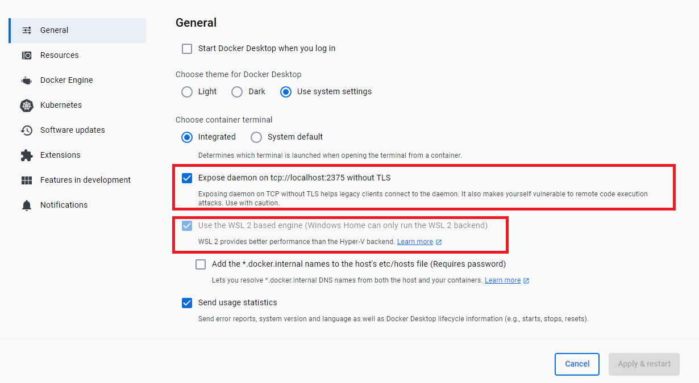

# Kubernetes (K8)

### Why K8?

**Kubernetes** (sometimes shortened to *K8s* with the 8 standing for the number of letters between the "K" and the "s") is *an open source system to deploy, scale and manage containerized applications anywhere*.

Kubernetes **automates operational tasks of container management** and includes built-in commands for deploying applications, rolling out changes to your applications, scaling your applications up and down to fit changing needs and monitoring your applications, making it easier to manage applications.

<br>

### What are the benefits of Kubernetes?
* **Automated operations**: Kubernetes has built-in commands to handle a lot of the heavy lifting that goes into application management, allowing you to automate day-to-day operations. You can make sure applications are always running the way you intended them to run.

* **Infrastructure abstraction**: When you install Kubernetes, it handles the compute, networking and storage on behalf of your workloads. This allows developers to focus on applications and not worry about the underlying environment.

* **Service health monitoring**: Kubernetes continuously runs health checks against your services, restarting containers that fail, or have stalled and only making available services to users when it has confirmed they are running.

* **Easier application upgrades and maintenance**: Kubernetes allows you to roll out new software versions, perform health checks and revert changes with minimal downtime.

* **Multi-cloud capability**: Kubernetes enables you to run your applications across multiple cloud providers without vendor lock-in or compatibility issues.

<br>


<br>

### Kubernetes vs. Docker
Often misunderstood as a choice between one or the other, **Kubernetes and Docker are different yet complementary technologies** *for running containerized applications.*

Docker lets you put everything you need to run your application into a box that can be stored and opened when and where it is required. Once you start boxing up your applications, you need a way to manage them; and that's what Kubernetes does.

Kubernetes is a Greek word meaning 'captain' in English. Like the captain is responsible for the safe journey of the ship in the seas, Kubernetes is responsible for carrying and delivering those boxes safely to locations where they can be used.

**Kubernetes can be used with or without Docker**: Docker is not an alternative to Kubernetes, so it's less of a “Kubernetes vs. Docker” question. It's about using Kubernetes with Docker to containerize your applications and run them at scale.

The difference between Docker and Kubernetes relates to the role each play in containerizing and running your applications:
* Docker is *an open industry standard* for packaging and distributing applications in containers
* Kubernetes *uses Docker* to deploy, manage and scale containerized applications


<br>

### When not to use K8?

* Kubernetes is complex and requires a lot of expertise to set up and maintain. You need to understand the concepts and components of Kubernetes (pods, services, deployments ingress etc). You also need to deal with security, networking, monitoring, logging and troubleshooting issues.

* Kubernetes is not necessary if you have a simple or monolithic application that does not need high availability, scalability or portability. Kubernetes is designed for distributed applications that have multiple services that need to communicate with each other and run on different nodes. If you have a single-page app or a small backend service that can run on a single server or a virtual machine, you might be better off using simpler tools. 


<br>

## Steps:

1. Install K8:




2. Check it works:

```shell
kubectl
```


```shell
kubectl get service
```


```shell
kubectl get svc
```


```shell
docker ps
```


```shell
docker images
```


* make the container scalable - 3 replicas 
* K8 Deployment
* 3 Pods
(rewatch video)


Dependencies:
docker image of node app available on docker hub
required ports enabled in the system
node-deployment.yaml


<br>

Sources:

- [What is Kubernetes](https://cloud.google.com/learn/what-is-kubernetes)