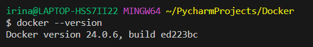
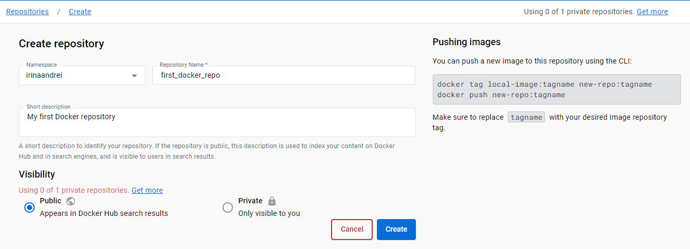
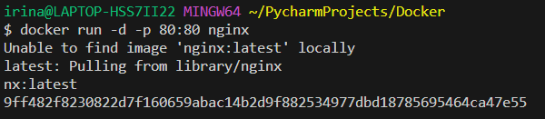
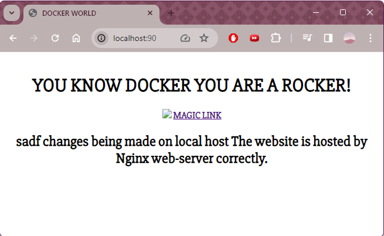
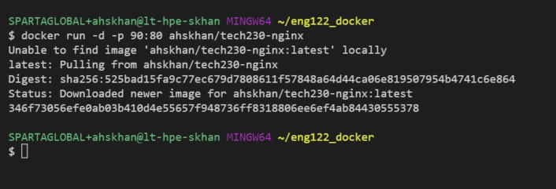
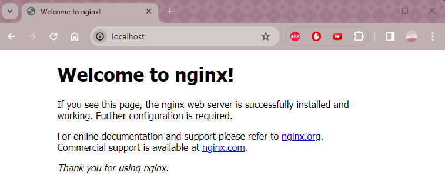
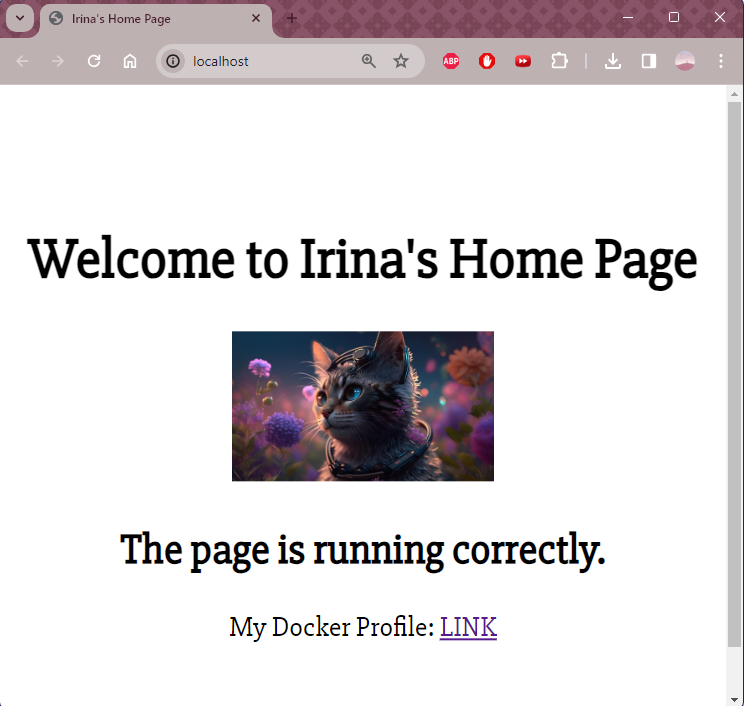

# Docker

### What is Docker? 
Docker is an open platform for developing, shipping and running applications. Docker enables you to separate your applications from your infrastructure so you can deliver software quickly. With Docker, you can manage your infrastructure in the same ways you manage your applications. By taking advantage of Docker's methodologies for shipping, testing, and deploying code, you can significantly reduce the delay between writing code and running it in production.

Docker provides the ability to package and run an application in a loosely isolated environment called **a container**. The isolation and security lets you to run many containers simultaneously on a given host. Containers are lightweight and contain everything needed to run the application, so you don't need to rely on what's installed on the host. You can share containers while you work, and be sure that everyone you share with gets the same container that works in the same way.

### Benefits of Docker:
* **Faster and easier deployment**: You can build, test, and deploy your app within a Docker container without worrying about the system requirements or configuration of the target platform. You can also share your container image with anyone and they can run it with a few commands.
* **Resource efficiency**: Docker containers are lightweight and use less resources than virtual machines, which run a separate operating system for each app. You can run multiple containers on the same host or server and share the resources among them.
* **Scalability and reliability**: You can easily scale up or down your app by adding or removing containers as needed. Docker containers are also reliable and consistent, as they run the same way on any platform.
* **Version control and reuse**: Docker containers have their own built-in mechanisms for versioning and component reuse. You can track the changes and updates of your container image and roll back to a previous version if needed. 

<br>

### Why do we need micro-services architecture?
Compared to *monolith architecture* (where the entire application is packaged into a single container) or *2-tier architecture* (where the application is split into two layers - a presentation layer that handles the user interface and a data layer that handles the data), in a **the micro-services architecture**, the application is divided into *smaller, independent services that communicate with each other through APIs*. Each service is packaged into **its own container** and can be deployed and scaled independently. 

Adopting microservices often goes hand in hand with **DevOps**, since they are the basis for *continuous delivery practices* that allow teams to adapt quickly to user requirements.

<br>

### Benefits of micro-services architecture:
* **Scalability**: it allows you to scale each service independently according to its demand, without affecting the rest of the application.
* **Performance**: it can improve the performance of the application by reducing the coupling and dependency between services. Each service can use its own technology stack and optimize its own performance without impacting other services. 
* **Reliability**: A microservices architecture can enhance the reliability of the application by increasing the fault tolerance and resilience of the system. If one service fails or becomes unavailable, it does not affect the functionality of other services or the whole application. The system can also recover faster from failures by restarting or replacing only the affected service.
* **Maintainability**: A microservices architecture can improve the maintainability of the application by simplifying the development and deployment process. Each service can be developed, tested, updated and deployed independently by different teams without affecting other services or requiring coordination. This can speed up the delivery cycle and reduce the risk of errors. 
* **Security**: A microservices architecture can strengthen the security of the application by isolating and protecting each service from external and internal threats. Each service can have its own authentication and authorization mechanisms and enforce its own security policies.


<br>

## Steps:

1. Install Docker: [Install Docker on Windows](https://docs.docker.com/desktop/install/windows-install/)

2. After Installing, open a Git Bash terminal:

```shell
docker
# see all the commands that you can use with Docker.

docker --version
# see the Docker version
```



3. Create Repository on Docker (this will host our *images/micro-services* - will track previous versions, when it was pushed, how many versions available etc):



4. Run an 'nginx' image:

```shell
docker run -d -p 80:80 nginx
# `-d`: detached mode - it detaches it and gives us terminal back (will run in background)
# `-p`: the port it will work (connecting port 80 of host machine with Docker) 
# `nginx`: name of the image.
```


If you go to your browser to [Local Host](http://localhost) - this will show Nginx (you don't need to add port 80 because the browser's default port is 80)



5. 
```shell
docker ps
docker ps -a
docker stop 9ff482f82308
docker start 9ff482f82308
docker run hello-world

docker images
# it will list all images.

docker rmi 593aee2afb64 -f
# remove image

docker rm
# remove container 
```


```shell
docker exec -it 63587d347825 sh

# `exec`: execute 
# `it`: internative mode
# `sh`: using shell
```


```shell
alias docker="winpty docker"
# if you run into errors
```

```shell
uname
uname -a

apt install sudo

apt update -y
apt upgrade -y

apt install sudo
```


```shell
cd /usr
pwd

cd /share
pwd

cd /nginx
pwd

cd /html
pwd

ls

cat index.html

apt install nano

sudo nano index.html

exit
```

```shell
docker ps

docker stop 63587d347825

docker start 63587d347825
```

You can run another image from Docker:

```shell
docker run -d -p 90:80 ahskhan/tech230-nginx
# Changing the port to 90 since we already had something running on port 80
```






Create a new index.html:

```html
<!DOCTYPE html>
<html>
<head>
    <title>Irina's Home Page</title>
    <link href="https://fonts.googleapis.com/css?family=Slabo+27px" rel="stylesheet">
    <style type="text/css">
    body {
        text-align:center;
        font-family: 'Slabo 27px', serif;
        height:100vh;
    }
    .vertical-center {

        position:relative;
        top:50%;
        transform: translateY(-50%);
    }
    img {
        width: 150px;
    }
    </style>
</head>
<body>
    <div class="vertical-center">
    <h1>Welcome to Irina's Home Page</h1>
    
    <h2>The page is running correctly.</h2>
    <p>My Docker Profile:
        <a href="https://hub.docker.com/u/irinaandrei">LINK</a>
    </p>
    </div>
</body>
</html>
```



<br>

Sources:
- [Install Docker on Windows](https://docs.docker.com/desktop/install/windows-install/)
- [Docker Overview - docker.com](https://docs.docker.com/get-started/overview/)
- [Monolithic vs Microservices Architecture - digiteum.com](https://www.digiteum.com/monolithic-vs-microservices-architecture/)
- [Microservices vs Monolith - atlassian.com](https://www.atlassian.com/microservices/microservices-architecture/microservices-vs-monolith)