# Docker

### What is Docker? 
Docker is an open platform for developing, shipping and running applications. Docker enables you to separate your applications from your infrastructure so you can deliver software quickly. With Docker, you can manage your infrastructure in the same ways you manage your applications. By taking advantage of Docker's methodologies for shipping, testing, and deploying code, you can significantly reduce the delay between writing code and running it in production.

Docker provides the ability to package and run an application in a loosely isolated environment called **a container**. The isolation and security lets you to run many containers simultaneously on a given host. Containers are lightweight and contain everything needed to run the application, so you don't need to rely on what's installed on the host. You can share containers while you work, and be sure that everyone you share with gets the same container that works in the same way.

<br>

### Benefits of Docker:
* **Faster and easier deployment**: You can build, test, and deploy your app within a Docker container without worrying about the system requirements or configuration of the target platform. You can also share your container image with anyone and they can run it with a few commands.
* **Resource efficiency**: Docker containers are lightweight and use less resources than virtual machines, which run a separate operating system for each app. You can run multiple containers on the same host or server and share the resources among them.
* **Scalability and reliability**: You can easily scale up or down your app by adding or removing containers as needed. Docker containers are also reliable and consistent, as they run the same way on any platform.
* **Version control and reuse**: Docker containers have their own built-in mechanisms for versioning and component reuse. You can track the changes and updates of your container image and roll back to a previous version if needed. 

<br>

### Why do we need micro-services architecture?
Compared to *monolith architecture* (where the entire application is packaged into a single container) or *2-tier architecture* (where the application is split into two layers - a presentation layer that handles the user interface and a data layer that handles the data), in a **micro-services architecture**, the application is divided into *smaller, independent services that communicate with each other through APIs*. Each service is packaged into **its own container** and can be deployed and scaled independently. 

Adopting microservices often goes hand in hand with **DevOps**, since they are the basis for *continuous delivery practices* that allow teams to adapt quickly to user requirements.

<br>

### Benefits of micro-services architecture:
* **Scalability**: it allows you to scale each service independently according to its demand, without affecting the rest of the application.
* **Performance**: it can improve the performance of the application by reducing the coupling and dependency between services. Each service can use its own technology stack and optimize its own performance without impacting other services. 
* **Reliability**: A microservices architecture can enhance the reliability of the application by increasing the fault tolerance and resilience of the system. If one service fails or becomes unavailable, it does not affect the functionality of other services or the whole application. The system can also recover faster from failures by restarting or replacing only the affected service.
* **Maintainability**: A microservices architecture can improve the maintainability of the application by simplifying the development and deployment process. Each service can be developed, tested, updated and deployed independently by different teams without affecting other services or requiring coordination. This can speed up the delivery cycle and reduce the risk of errors. 
* **Security**: A microservices architecture can strengthen the security of the application by isolating and protecting each service from external and internal threats. Each service can have its own authentication and authorization mechanisms and enforce its own security policies.


<br>

## Steps:

1. Install Docker: [Install Docker on Windows](https://docs.docker.com/desktop/install/windows-install/)

2. After Installing, open a Git Bash terminal:

```shell
docker
# see all the commands that you can use with Docker.

docker --version
# see the Docker version
```


3. Create Repository on Docker (this will host our *images/micro-services* - will track previous versions, when it was pushed, how many versions available):


4. Run an 'nginx' image:

```shell
docker run -d -p 80:80 nginx
# `-d`: detached mode - it detaches it and gives us the terminal back (will run in background)
# `-p`: the port it will work on (connecting port 80 of host machine with Docker) 
# `nginx`: name of the image.
```


If you go to your browser to [Local Host](http://localhost) (http://localhost) - this will show Nginx (you don't need to add port 80 because the browser's default port is 80)


#### What happened in the background:
Docker created a container out of the image that was hosted on Docker Hub. The Docker Hub has all the images/micro-services hosted and you can use anything.  


5. If you want to see the containers list (we didn't provide a name when we created the container, so it randomly chose a name for us): 

```shell
docker ps
# This will show all containers running.

docker ps -a
# This will show all containers, including stopped ones.
```

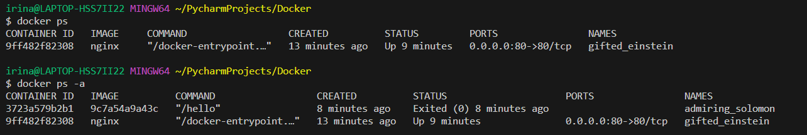

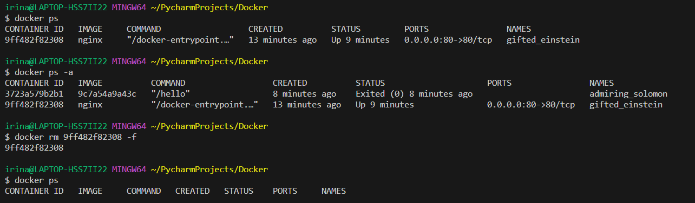

6. If you want to stop or start the container:

```shell
docker stop 9ff482f82308
# stopping the container

docker start 9ff482f82308
# starting the container

# if there is no error and it echoes the Container ID, it means the command worked.
```

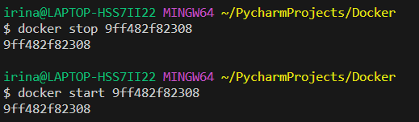

7. If you want to test if Docker has connectivity integration to Docker Hub:

```shell
docker run hello-world

# if you have it locally available, it won't say anything. 
# if you don't have it locally available, it will say it's not avilable and that it will have to connect to Docker Hub and check if it can be downloaded.
```

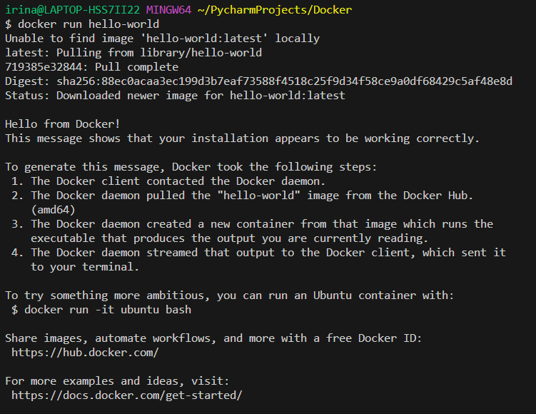

8. If you want the list of all images that have been downloaded:

```shell
docker images
# it will list all images downloaded.
```

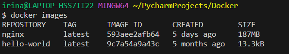

9. If you want to delete an image: 

```shell
docker rmi 593aee2afb64 -f
# `rmi`: remove image
# `-f`: with force
# this would remove 'nginx' image; but it won't work, as the image is being used by a running container.
```

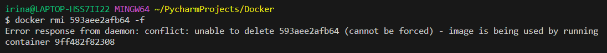

```shell
docker rmi 9c7a54a9a43c -f
# this will remove 'hello-world' image; it needs to be forced as there still is a stopped container with this image.
```

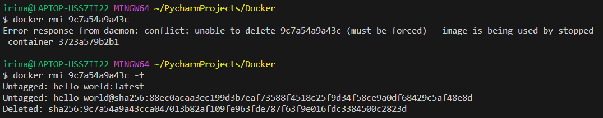


10. If you want to remove a container: 

```shell
docker rm 9ff482f82308 -f
# this will remove the container 
```


11. Run 'nginx' again. After that, we will interact with the running container, 'nginx':

```shell
docker run -d -p 80:80 nginx

docker exec -it 63587d347825 sh
# `exec`: execute 
# `it`: interactive mode
# `63587d347825`: 'nginx' container ID
# `sh`: using shell
```

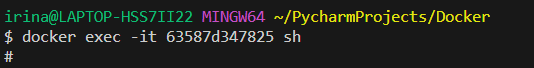

12. If you have the 'winpty' error, run this command:

```shell
alias docker="winpty docker"
# only if you run into errors
```

13. Now we are inside the 'nginx' container. We can get more information about it and run the relevant updates:

```shell
uname
uname -a

apt install sudo
# This will install sudo

apt update -y
apt upgrade -y

apt install sudo
# By doing command again, you can check that it was installed correctly. 
```

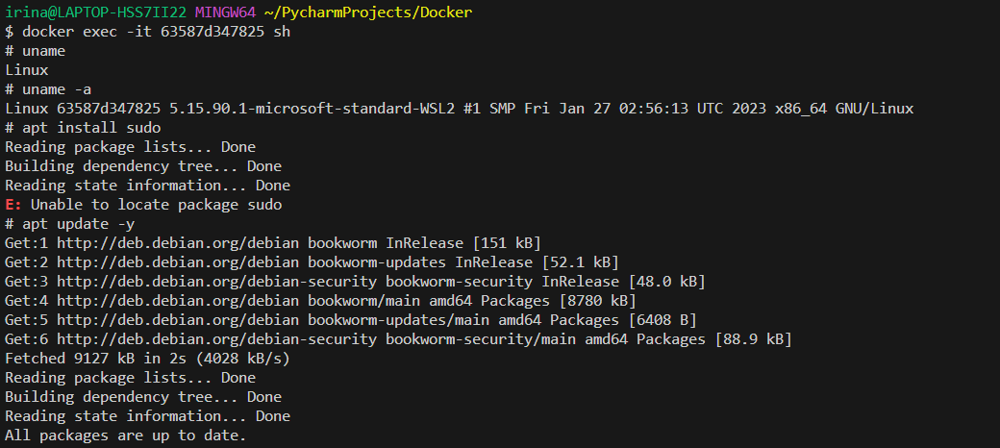

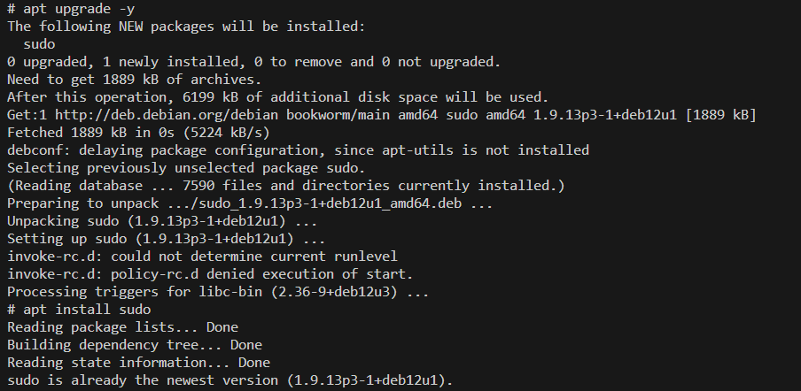

14. Find the 'index.html' that we have to modify:

```shell
cd /usr
cd /share
cd /nginx
cd /html
pwd
ls
cat index.html
```


15. Next, we will install `nano` and modify 'index.html':

```shell
apt install nano

sudo nano index.html
# any modifications will show up live on 'localhost' page after you click Refresh. We are hosting a static website in 'nginx', running locally.
```

16. If you want to exit and go back to your OS:

```shell
exit
```

17. You can stop and start the container, and you will see we haven't lost the data (when you Refresh 'local host'):

```shell
docker ps
# Finding the new container ID for 'nginx'. 

docker stop 63587d347825
# Stopping 'nginx' container.

docker start 63587d347825
# Starting 'nginx' container.
```

18. You can run another image from Docker:

```shell
docker run -d -p 90:80 ahskhan/tech230-nginx
# Changing the port to 90 since we already had something running on port 80
```


<br>

### Steps for pushing an image to Docker Hub:

1. Create a new 'index.html' and add the profile to it:

```html
<!DOCTYPE html>
<html>
<head>
    <title>Irina's Home Page</title>
    <link href="https://fonts.googleapis.com/css?family=Slabo+27px" rel="stylesheet">
    <style type="text/css">
    body {
        text-align:center;
        font-family: 'Slabo 27px', serif;
        height:100vh;
    }
    .vertical-center {

        position:relative;
        top:50%;
        transform: translateY(-50%);
    }
    img {
        width: 150px;
    }
    </style>
</head>
<body>
    <div class="vertical-center">
    <h1>Welcome to Irina's Home Page</h1>
    
    <h2>The page is running correctly.</h2>
    <p>My Docker Profile:
        <a href="https://hub.docker.com/u/irinaandrei">LINK</a>
    </p>
    </div>
</body>
</html>
```


2. Copy the 'index.html' to the 'nginx' container:

```shell
docker cp -a index.html 63587d347825:usr/share/nginx/html
```
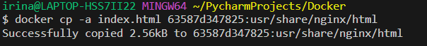

3. Create a 'Dockerfile' file and enter the edit mode:

```shell
touch Dockerfile
nano Dockerfile
```

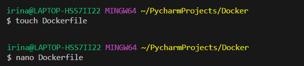

4. In Dockerfile, add: 

```shell
FROM nginx
COPY index.html /usr/share/nginx/html
```

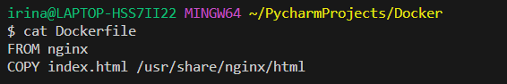

3. Build the image:

```shell
docker build -t irina_nginx .
```

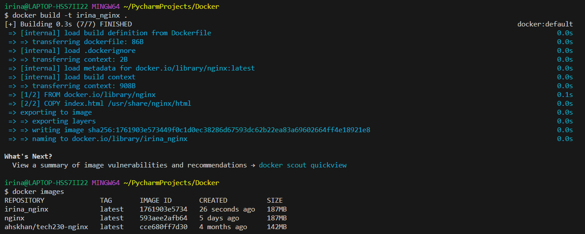

4. Push to Docker Hub:

```shell
docker tag irina_nginx irinaandrei/first_docker_repo:latest
docker push irinaandrei/first_docker_repo:latest
```

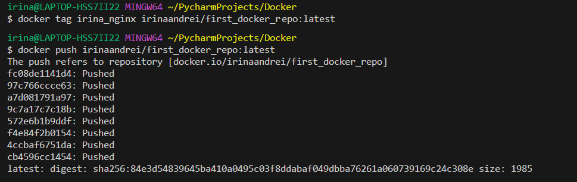

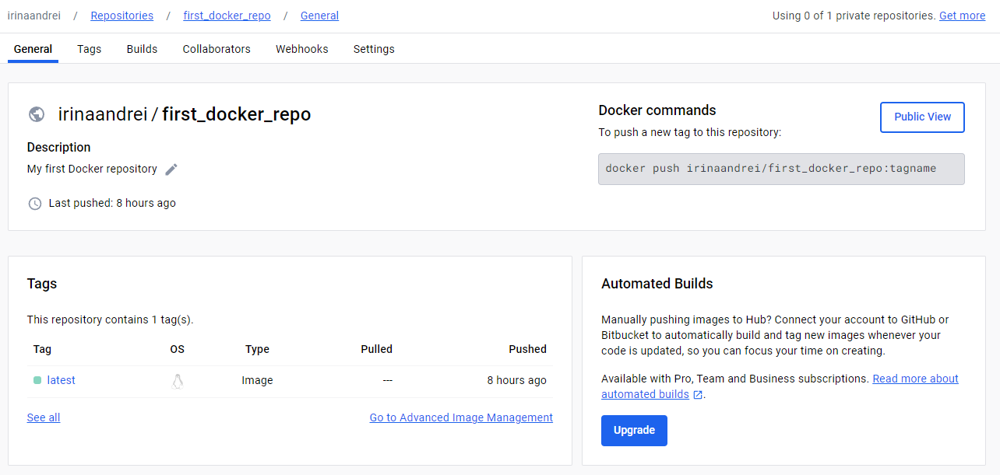

5. To check it has worked, you can run the command:

```shell
docker run -d -p 100:80 irinaandrei/first_docker_repo:latest
```

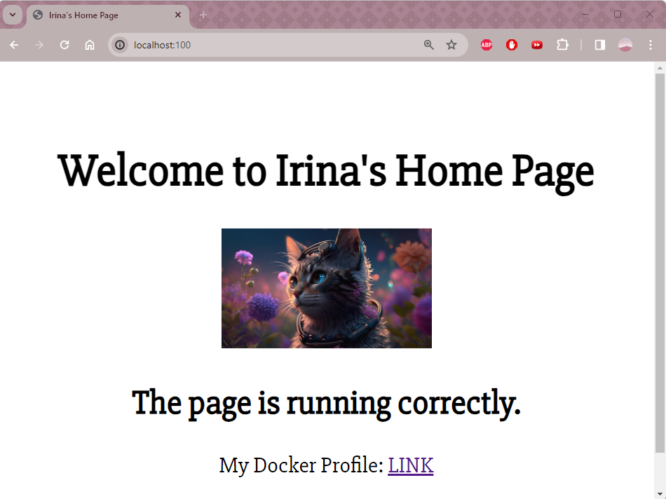

<br>

Sources:
- [Install Docker on Windows](https://docs.docker.com/desktop/install/windows-install/)
- [Docker Overview - docker.com](https://docs.docker.com/get-started/overview/)
- [Monolithic vs Microservices Architecture - digiteum.com](https://www.digiteum.com/monolithic-vs-microservices-architecture/)
- [Microservices vs Monolith - atlassian.com](https://www.atlassian.com/microservices/microservices-architecture/microservices-vs-monolith)